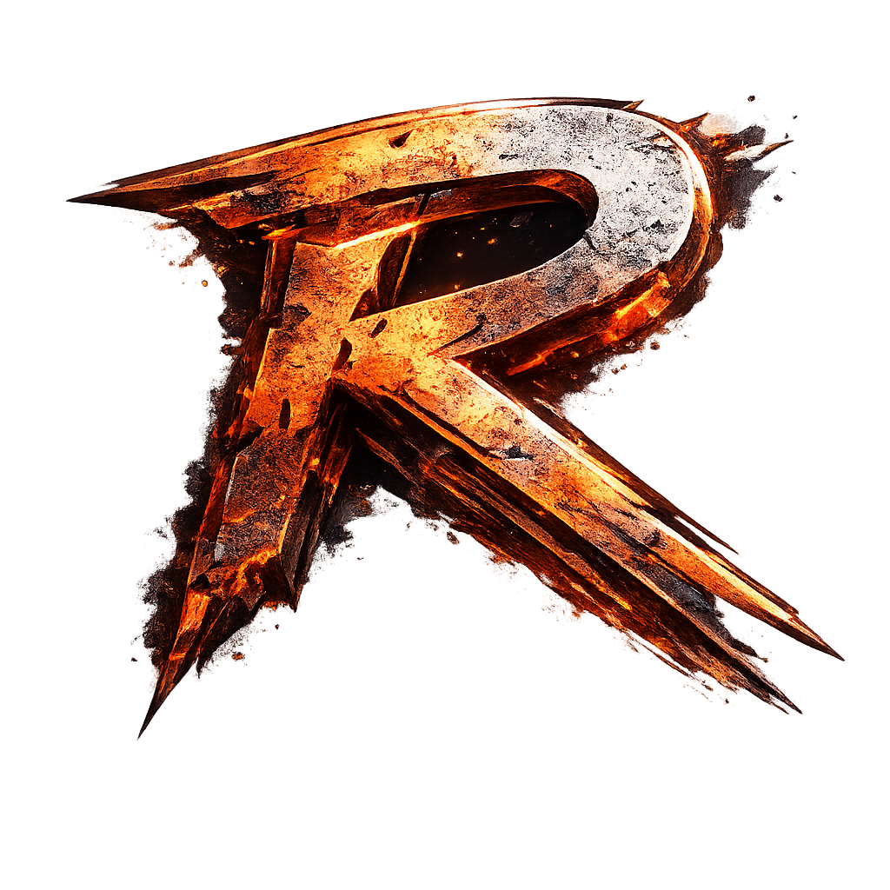

<p align="center">
  
</p>

<h1 align="center">Rustix Engine</h1>

<p align="center">
  A modern, high-performance game engine built in Rust, targeting Linux (Wayland/X11) with Vulkan.
</p>

<p align="center">
  <a href="https://tigerlero.github.io/Rustix/">Website</a> ·
  <a href="docs/FEATURES.md">Features</a> ·
  <a href="docs/ARCHITECTURE.md">Architecture</a> ·
  <a href="docs/ROADMAP.md">Roadmap</a>
</p>

## Quick Start

```bash
# Build everything
cargo build

# Run the editor / runtime
cargo run -p rustix-runtime

# Run with optimizations
cargo run -p rustix-runtime --release

# Check compilation
cargo check

# Run all tests
cargo test

# Run core crate tests only
cargo test -p rustix-core --lib

# Build release binary
cargo build -p rustix-runtime --release
```

## Requirements

- **Rust** 1.95+ stable
- **Vulkan** 1.3 capable GPU (NVIDIA recommended)
- **Linux** (Pop!_OS / Ubuntu with Wayland or X11)
- Vulkan drivers installed (`nvidia-driver-*` or `mesa-vulkan-drivers`)

Optional for validation:
- `vulkan-validationlayers` (debug output)
- `vulkan-sdk` / `glslang-tools` (shader compilation)

## Website & Assets

- **Website**: [tigerlero.github.io/Rustix](https://tigerlero.github.io/Rustix/)
- **Brand assets**: [docs/assets.html](docs/assets.html) — logos, icons, color reference

## Architecture

```
rustix/
├── crates/
│   ├── core/        # ECS, job system, math, memory, config, diagnostics
│   ├── platform/    # Window, input (winit + Wayland/X11)
│   ├── render/      # Vulkan renderer (ash 0.38) — pipelines, shaders, frame graph
│   ├── asset/       # Asset server (typed handles, path mapping, hot-reload registry)
│   ├── audio/       # Audio engine
│   ├── ai/          # Navigation, pathfinding, behavior trees, GOAP
│   ├── physics/     # Rapier 3D integration
│   ├── animation/   # Skeletal animation, clips, blending
│   ├── networking/  # UDP protocol, prediction, interpolation, lag compensation
│   ├── scripting/   # Rhai scripting with ECS bindings
│   ├── ui/          # Game UI renderer (egui integration)
│   ├── terrain/     # Heightmap generation, chunk streaming
│   ├── world/       # World streaming, region management
│   └── editor/      # Editor support crate
├── apps/
│   └── runtime/     # Editor + runtime binary (egui, scene editing, project management)
├── docs/            # Architecture, roadmap, features, design philosophy, website
├── shaders/         # Vulkan GLSL shader source files
└── assets/          # Engine assets (logo, icons)
```

## Current Capabilities

### Rendering
- **Vulkan 1.3** renderer with dynamic rendering (no RenderPass)
- **GPU memory** via gpu-allocator (device-local + host-visible)
- **Staging buffer ring allocator** with fence tracking for async CPU→GPU uploads
- **Procedural geometry**: cubes, toruses, UV spheres, icospheres, planes
- **Indexed rendering** with vertex buffers + push constants
- **Uniform buffers** with descriptor sets and bindless descriptors
- **Depth testing** (D32_SFLOAT) with configurable culling
- **Multi-object scenes** with orbiting camera
- **naga** runtime GLSL → SPIR-V compilation
- **Post-processing**: Bloom, SSAO, TAA, SSR, Volumetric Fog, Skybox/Atmosphere
- **HDR rendering** with ACES tone mapping
- **OIT** (Order-Independent Transparency) with weighted blended accumulation
- **Instanced rendering** + GPU culling
- **Mesh shaders** (NV extension) fallback to instanced
- **Shadow mapping** — CSM, point shadows, spot shadows
- **Forward+ tiled lighting** (8 point lights)
- **G-Buffer / Deferred lighting** pipeline

### ECS & Core
- **hecs** archetypal ECS with query filters (`With`, `Without`)
- **Component registry** — type-erased storage via `TypeId` + vtable (size, align, clone, drop, default)
- **Dynamic bundles** — runtime component addition via `ComponentRegistry::insert_bundle`
- **Command buffers** — deferred world mutation (`Spawn`, `Despawn`, `InsertBundle`, `Remove`, etc.)
- **Change detection** — dirty flags per component per tick (`flag<T>()`, `is_changed<T>()`, `changed_entities::<T>()`)
- **Component groups** — named sets for cache-optimal archetype pre-warming
- **Multi-world support** — `WorldRegistry` for game / editor / preview worlds with entity mapping
- **Transform hierarchy** — BFS world matrix computation with cycle detection and topological ordering

### Jobs & Memory
- **Job system** — `rayon` work-stealing thread pool with configurable thread count and work queue depth
- **Task graph** — DAG dependency system with Kahn's topological sort and parallel frontier execution
- **Priority task system** — dedicated threads with high / medium / low priority queues
- **Frame allocator** — atomic bump allocator, O(1) reset per frame
- **Pool allocator** — fixed-size object reuse with chunk-based growth
- **Thread-local arenas** — per-thread `FrameAllocator` for zero-contention allocation
- **Cache-line aligned** allocations (64-byte alignment)

### Configuration & Diagnostics
- **TOML-based engine config** — layered: default → project → user → CLI overrides
- **Runtime config reload** — polling file watcher with callback-based reload (`ConfigWatcher`)
- **Hot-key toggles** — `DevToggles` (dev mode, debug render, profiling) with `F1/F2/F3` defaults
- **Structured logging** via `tracing` with console + JSON file output
- **JSON file logging** — `JsonFileLayer` writes JSON Lines per event with span context and field escaping
- **Log capture** — circular in-memory buffer for runtime log inspection
- **Per-crate log level filtering**

### Platform
- **Wayland native** support (primary target for Pop!_OS)
- **X11 fallback** (xcb backend)
- **Fullscreen exclusive** — picks best video mode; falls back to borderless
- **Borderless fullscreen windowed** — fills screen without video mode change
- **Input state** — current + previous frame for "just pressed" edge detection
- **File dialogs** — native picker via `rfd`

### Assets & Editor
- **Asset system** — typed handles + path mapping + hot-reload registry
- **GLTF loading** — mesh + material import
- **Editor UI** — egui-based with scene graph, inspector, viewport, project manager, console
- **Undo/redo** — command-based history system
- **Settings panel** — accessible pre-project, with post-process controls
- **Sprite editor** — 2D sprite atlas editing
- **Waveform viewer** — audio visualization
- **Profiler overlay** — frame time + GPU zones (Tracy integration)

## Documentation

- [Feature Breakdown](docs/FEATURES.md) — full checklist of implemented and planned features
- [Architecture](docs/ARCHITECTURE.md) — crate layout, data flow, module breakdown
- [Subsystem Reference](docs/SUBSYSTEMS_REFERENCE.md) — detailed subsystem documentation
- [Design Philosophy](docs/DESIGN_PHILOSOPHY.md)
- [Development Roadmap](docs/ROADMAP.md)
- [Implementation Status](docs/IMPLEMENTATION_STATUS.md)
- [Settings Missing Features](docs/settings.md) — settings not yet exposed in UI
- [Rhai Scripting Guide](docs/RHAI_GUIDE.md)
- [UI Implementation Plan](docs/UI_IMPLEMENTATION.md)
- [Crash Log Guide](docs/CRASH_LOG.md)
- [Font Rendering](docs/FONT_RENDERING.md)
- [Pending Tests](docs/PENDING_TESTS.md)

## License

MIT — see [LICENSE](LICENSE)
